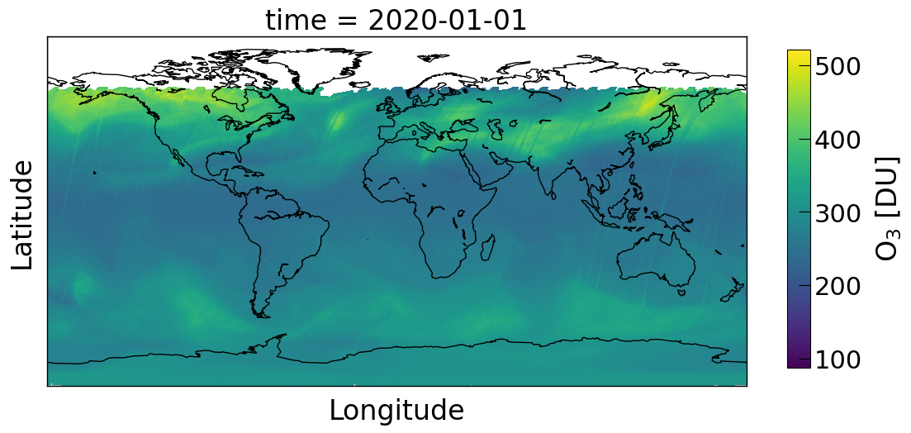

Python scripts to read and correct satellite atmospheric composition data (both profile and column).

## Implemented satellites inlcude:
- [GOME2 Trace Gas Columns](https://www.eumetsat.int/website/home/Satellites/CurrentSatellites/Metop/MetopDesign/GOME2/index.html)
- [Aura-MLS](https://mls.jpl.nasa.gov/)
- [Suomi-NPP OMPS](https://www.star.nesdis.noaa.gov/icvs/status_NPP_OMPS_LP.php)

# Usage

```python
from satellite import MLSProfile
from satellite import OMPSProfile
from satellite import GOMEColumn, GOME
```

## for GOME2 Columns

```python
filename = '/home/pankaj/arctic/GOME_O3-NO2-NO2Tropo-BrO-SO2-H2O-HCHO_L2_20200101001028_051_METOPA_68496_DLR_04.HDF5'

gcol = GOMEColumn(filename)
data = gcol.read(fields=['O3', 'NO2'])

field = 'O3'
spacing = 0.25
files = sorted(glob.glob('/home/pankaj/arctic/*METOP*.HDF5'), \
               key=lambda x:int(x.split('L2')[-1].split('_')[1]))
gome2 = GOME(files, field, spacing).resample('D')
fig, ax, cb, m = gome2.plot(scale=1, figsize=(14, 5.5))
plt.show()
```


## for MLS Profiles

```python
filename = '/media/pankaj/ext2/data/profile/clo/MLS-Aura_L2GP-ClO_v04-20-c01_2010d335.he5'
biasfile = '/home/pankaj/phd/code/satellite/satellite/MLS-Aura_ClO-BiasCorrection_v04.txt'

mls = MLSProfile(filename)
concentration, precision = mls.correct(biasfile=biasfile)
```

## for OMPS Ozone profiles

```python
filename = '/media/pankaj/ext2/data/profile/omps/OMPS-NPP_LP-L2-O3-DAILY_v2.5_2019m1201_2019m1202t142927.h5'
omps = OMPSProfile(filename2)
UVozone, UVozonePrecision, VisibleOzone, VisibleOzonePrecision = omps.correct(vmr=True)
```
